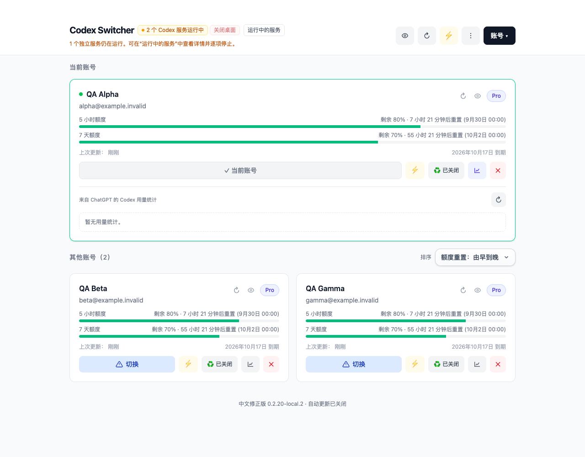
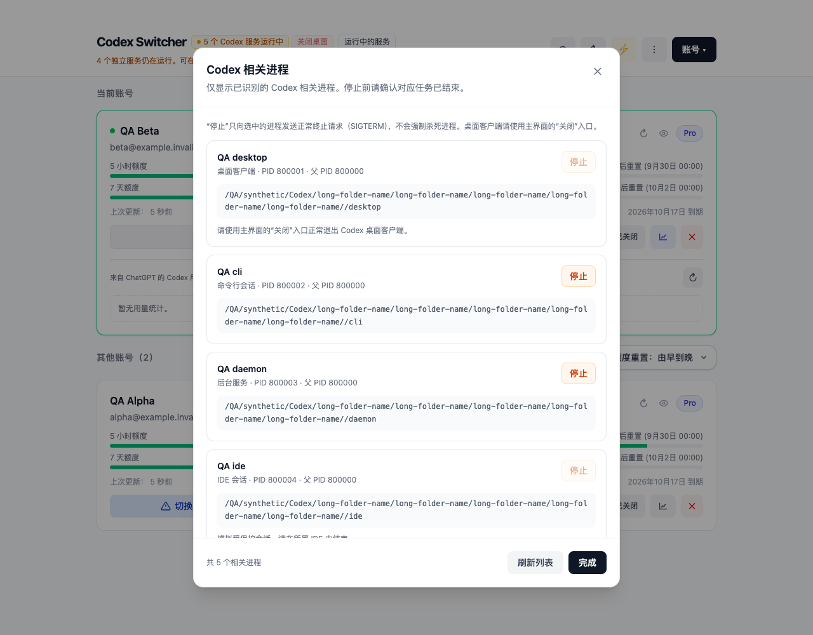

# Codex Switcher 中文版 · Codex 多账号切换工具

**面向 macOS 的 Codex 桌面客户端多账号管理工具：中文界面、账号切换、额度查看、运行服务管理和按钮悬浮说明。**

[下载安装包](https://github.com/guangfuhao/codex-switcher-zh-cn/releases/latest) · [使用说明](docs/使用说明.md) · [更新记录](CHANGELOG.md) · [原项目与致谢](ACKNOWLEDGEMENTS.md)

本项目由 [guangfuhao](https://github.com/guangfuhao) 独立维护，基于 [Lampese/codex-switcher](https://github.com/Lampese/codex-switcher) 改进。感谢 **Lampese 和原项目贡献者**提供账号管理、OAuth 登录、用量统计及桌面应用基础。此项目不是 OpenAI 官方产品。

## 界面预览

以下截图使用虚构的 QA 账号、额度和进程，不包含维护者的真实账号。



<details>
<summary>查看运行服务管理面板</summary>



</details>

## 适合谁使用

如果你有多个 ChatGPT / Codex 账号，希望减少反复退出登录的操作，并能看懂账号额度和切换条件，可以使用这个中文版。

可搜索关键词：**Codex 中文版、Codex 账号切换、Codex 多账号管理、ChatGPT 账号切换工具、Codex 额度查询、macOS Codex 桌面客户端**。

## 功能

| 功能 | 使用方式 |
| --- | --- |
| 简体中文界面 | 主页、设置、下拉菜单、账号弹窗和原生菜单默认中文 |
| 多账号管理 | 通过 ChatGPT 官方 OAuth 登录或导入已有 `auth.json` 添加账号 |
| 显式账号切换 | 添加或导入只保存账号；点击“切换”后才变更 Codex 登录 |
| 额度查看 | 显示账号返回的短周期和每周额度、重置时间及用量信息 |
| 运行服务面板 | 查看 Codex 相关进程的名称、PID、类型、父 PID 和执行路径 |
| 逐项手动停止 | 对允许停止的独立服务逐项确认，只发送正常终止请求 |
| 中文功能说明 | 悬停或聚焦按钮即可查看说明；设置项下方直接解释用途 |
| 账号备份 | 沿用上游的文本及完整备份导入导出功能 |
| 预热与定时预热 | 可选功能，会发送测试请求并消耗少量额度 |

## 下载与安装

当前发布版本：**v0.2.20-local.2**。本次提供 **macOS Apple Silicon（M 系列芯片）** 安装包。

1. 打开 [Releases](https://github.com/guangfuhao/codex-switcher-zh-cn/releases/latest)。
2. 下载 `Codex-Switcher-zh-CN-0.2.20-local.2-macOS-arm64.zip`。
3. 解压，将 `Codex Switcher.app` 放入“应用程序”，然后打开。
4. 主页底部应显示“中文修正版 0.2.20-local.2”。

此包使用本地临时签名，**尚未经过 Apple 公证**。macOS 可能阻止首次打开；请核对仓库来源与 Release 中的 SHA-256。也可自行从源码构建，不建议全局关闭系统安全保护。

本版本保留原应用名称和标识，便于替换已有 Codex Switcher；更新前请退出旧版。本地账号配置位于 `~/.codex-switcher`。上游自动更新已关闭，避免覆盖中文版修改。

**Intel Mac、Windows 和 Linux 本次未提供经过验证的安装包。浏览器 / 局域网服务模式也不在本版本验收范围内。**

## 使用步骤

1. 点击“添加账号”，在浏览器完成 ChatGPT 官方登录。为每个账号重复一次。
2. 添加账号不会自动切换当前 Codex 登录。授权失效或被撤销时，需要重新登录。
3. 切换前先完成当前任务。点击目标账号的“切换”，按提示处理仍在运行的服务。
4. 在“运行中的服务”里核对目标进程，确有需要时逐项停止。桌面客户端使用“关闭桌面”流程。
5. 设置“退出后重新打开 Codex”；账号切换成功后，才会按设置重开桌面。

**正在执行的任务可能因停止服务或退出 Codex 而中断。** 手动停止会明确显示目标名称和 PID，并要求确认；工具不会强制杀进程、提权或一键结束全部服务。

## 相对上游的主要改进

- 新增、导入与删除账号不触发隐式切换。
- 取消或被替换的 OAuth 流程不会误保存账号。
- 根据官方登录文件识别当前账号，保存匹配账号的最新凭据，避免用旧状态覆盖当前登录。
- 切换前再次检查运行状态；桌面仅正常退出，不提供强制关闭。
- 手动停止独立服务使用一次性身份确认，并核验路径、启动时间及所属用户，防止使用过期列表误停进程。
- 正确遵守“保持关闭”，不因后台返回重开标识而自行启动 Codex。
- 主页、设置、用量显示、托盘及原生菜单中文化，补充悬浮提示与设置说明。

## 常见问题

### 为什么某些服务不能停止？

桌面客户端、桌面所属后台进程、本工具及其祖先进程、其他用户的进程，或无法核验身份的进程，会显示禁用原因。请从对应程序或原终端正常结束，再刷新列表。服务如果被其他程序重新拉起，会出现新的 PID。

### 闪电按钮是什么？

这是账号预热功能，会向所选账号发送少量测试请求，消耗少量额度。不是刷新按钮，也不会增加或合并额度。

### 需要输入账号密码到工具里吗？

不需要。通过官方网页完成登录，工具保存授权后的凭据。请不要把账号密码、`auth.json`、账号库或备份文件上传到仓库或 Issue。

### 登录凭据保存在哪里？

沿用上游本地文件存储，并限制文件权限；**不是系统钥匙串**。导出备份也包含登录凭据，应妥善保管。正常的登录、额度查询和预热会访问上游相应服务。

### 能同时登录多个 Codex 桌面实例吗？

本工具管理多个已保存账号，并切换共享的 Codex 登录状态；不提供多实例隔离，也不合并不同账号的订阅额度。

## 从源码构建

环境：macOS、Node.js 24、pnpm 10、Rust stable（本地验收使用 Rust 1.92）、Xcode Command Line Tools。

```bash
git clone https://github.com/guangfuhao/codex-switcher-zh-cn.git
cd codex-switcher-zh-cn
pnpm install --frozen-lockfile
pnpm build
cargo test --locked --manifest-path src-tauri/Cargo.toml --lib
node --experimental-strip-types --test tests/*.test.ts
pnpm tauri build --bundles app
```

应用输出目录：`src-tauri/target/release/bundle/macos/`。仓库 CI 只做构建与回归校验，Release 安装包由维护者单独发布，避免误用上游的签名或发布配置。

## 验证情况

- 后端回归：72 项通过；默认忽略的实机诊断不由普通 CI 执行。
- 前端逻辑测试：15 项通过。
- 隔离模拟界面：中文设置、滚动布局、悬浮说明、进程详情、取消停止、身份失效恢复、停止结果刷新、正常关闭及不重开路径均已检查。
- 实机：已验证 Apple Silicon 安装、启动、中文界面及只读服务枚举。

模拟测试没有自动停止真实服务或替用户切换真实账号，不应将模拟结果视为所有设备和账号均已验证。

## 原作者与来源

- 原项目：[Lampese/codex-switcher](https://github.com/Lampese/codex-switcher)
- 原作者：[Lampese](https://github.com/Lampese)
- 基础版本：`0.2.20`
- 基础提交：[`9dec3c18a856abbb545241ae867c5b5ba9d92fa6`](https://github.com/Lampese/codex-switcher/commit/9dec3c18a856abbb545241ae867c5b5ba9d92fa6)

保留上游 Git 历史和作者署名。本仓库的新增工作是中文化、交互说明、账号状态及运行服务处理方面的修改，并非从零实现。详见 [致谢与权利说明](ACKNOWLEDGEMENTS.md)。
